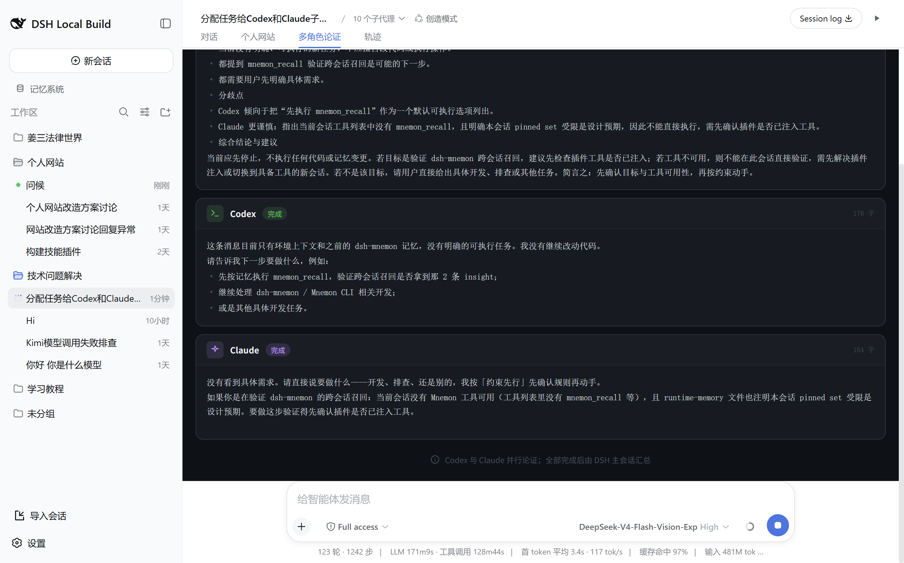
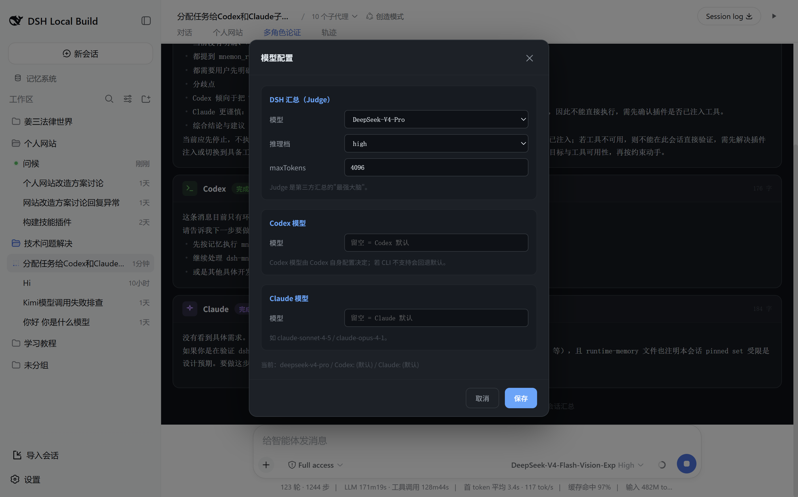

# 多角色并行论证 DSH 插件（multi-role-debate）

[](https://github.com/jiang12345-code/dsh-multi-role-debate/actions/workflows/ci.yml)
[](https://github.com/topics/dsh-plugin)

在 DeepSeek Harness 里跑一套**多角色并行论证 + 单 Agent 直接对话**系统：真实 **Codex** 与 **Claude** CLI 并行论证，**DSH 主会话模型（Judge）**做第三方汇总并回对话，另有 Obsidian 式单 Agent 直接对话。

> ⚠️ **前置依赖（必读）**：本插件是真实 **Codex** 与 **Claude** CLI 的**薄封装，不内置二进制**。使用前你的机器必须已安装：
> - **Codex CLI** —— `@openai/codex`（提供 `codex` 命令；DSH 侧须能经 `node <@openai/codex/bin/codex.js>` spawn）
> - **Claude Agent SDK** —— `@anthropic-ai/claude-agent-sdk-*`（或 `claude` 命令）
> 缺这两者，插件能装上但"开始论证/直接对话"起不来。

> 一套能调用 codex/claude、实现多模型论证的实体功能。`dsh-multi-role-debate` 是**聚合安装包**：装它 = 装齐下面全部 3 个组件。

## 效果演示
| 多角色并行论证 | 模型自由配置 | 结果回对话 |
|---|---|---|
|  |  |  |

- **论证面板**：Codex / Claude 两栏并行流式 + DSH 汇总，各自徽章（完成/Streaming）+ 字数 + markdown 正文。
- **模型配置**：⚙ 弹窗，Judge 模型下拉 + 推理档 + maxTokens，Codex/Claude 模型自由填，保存持久化。
- **结果回对话**：论证完成后，DSH 主会话自动把汇总呈现到对话流（`agent.followup()`，turn 安全）。

## 组成
| 包 | 作用 |
|---|---|
| `dsh-multi-role-debate`（本次新增，入口） | 聚合包：`cordis.patch.yml` 注册 3 个组件；依赖它们 |
| `dsh-codex-agent` | host 实体：长驻真实 `codex app-server`（JSON-RPC 2.0） |
| `dsh-claude-agent` | host 实体：长驻真实 `claude-agent-sdk` query() |
| `multi-role-debate` | 编排 + 前端：多角色论证 / 对话流触发 / DSH 汇总 / 结果回对话 / 直接对话 UI / 模型配置 |

## 能力
- **能力1 · 多角色并行论证**：tab 按钮或**主对话流触发**（发"多角色论证/辩论/开始论证 X"）→ Codex+Claude 并行流式 → DSH Judge（独立强模型）生成汇总 → `agent.followup()` 自动回对话呈现。
- **能力2 · 单 Agent 直接对话**：Obsidian 式点选 Codex/Claude，权限弹窗（Read Only / Full access）。
- **模型自由配置**：tab 顶栏 ⚙ 弹窗，Judge 下拉 + Codex/Claude 自由填，持久化。
- **UI**：GitHub Dark 主题，手写 CSS + `React.createElement`（无 JSX/Tailwind）。

## 前置依赖（重要）
> 见顶部「⚠️ 前置依赖（必读）」：本机需已装 **Codex CLI**（`@openai/codex`）与 **Claude Agent SDK**（`@anthropic-ai/claude-agent-sdk`）。本插件是这两个真实 CLI 的薄封装，不内置二进制。

## 安装（用户侧）
**方式一 · 一键脚本（推荐，Windows）**：在仓库根执行
```powershell
pwsh install.ps1 -Profile web        # 默认安装到 web profile；用 -Profile <name> 换
pwsh install.ps1 -Profile web --uninstall   # 撤销：恢复 3 个单独条目
```
脚本会：把 `dsh-codex-agent / dsh-claude-agent / multi-role-debate / dsh-multi-role-debate` 复制进目标 profile 的 `node_modules`，并把 `dsh.profile.bundles` 里的 3 个单独条目换成聚合包一条。然后**重启 DSH**。

**方式二 · 手工（参考）**：
1. 克隆本仓库（或拿到 `dsh-multi-role-debate` 目录）。
2. 把 4 个包装进你的 DSH profile：`cd ~/.dsh/profiles/web && npm install /path/to/repo/<包>`（或复制到 `node_modules`）。
3. 编辑 `~/.dsh/profiles/web/package.json`，在 `dsh.profile.bundles` 把旧的 `dsh-codex-agent`/`dsh-claude-agent`/`multi-role-debate` 三条去掉，追加 `"dsh-multi-role-debate"`。
4. **重启 DSH**；对话视图顶部出现"多角色论证" tab 即成功。

> 说明：聚合包 `cordis.patch.yml` 会插入 `dsh-codex-agent`、`dsh-claude-agent`、`multi-role-debate` 三行（实体在前、编排在后），一次安装即注册全部组件。**前置依赖**：本机需已装 Codex CLI（`@openai/codex`）与 Claude Agent SDK（`@anthropic-ai/claude-agent-sdk`）——本插件是这两个真实 CLI 的薄封装，不内置二进制。

## 使用
- **tab（多角色论证）**：输入问题 → 开始论证；或切"直接对话"点选 Codex/Claude。
- **主对话流触发**：直接发"多角色论证：<问题>"。
- **配置模型**：顶栏 ⚙ → 选 Judge 模型 + 填 Codex/Claude 模型 → 保存。

## 已知坑 / 项目记忆
改写代码前先读本项目根 `AGENTS.md`（含 7 条血泪坑：`pull()` 增量累加、`agent.followup()` 回对话、触发器跳过插件消息、CSS/SVG、router/spawn、模型路由、无 JSX；以及会话日志安全红线）。

## License
MIT
